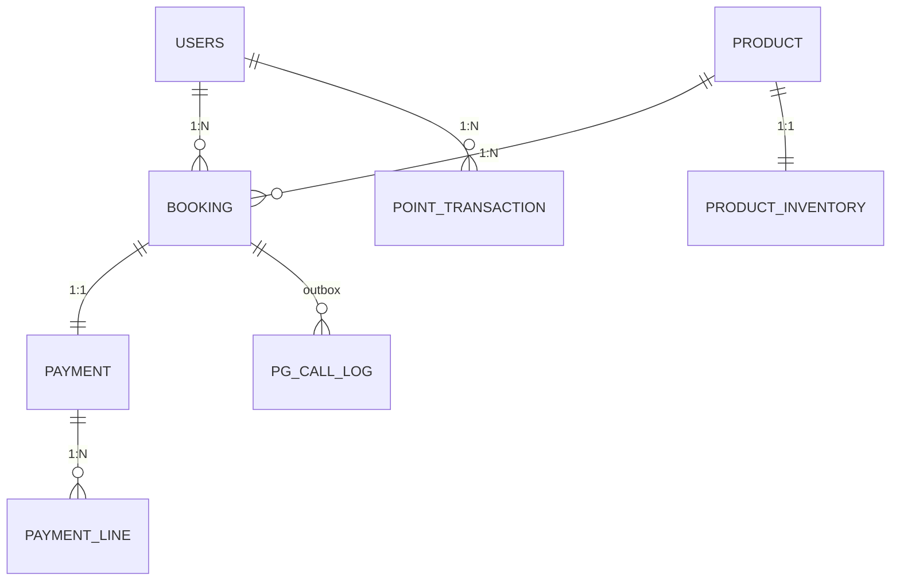
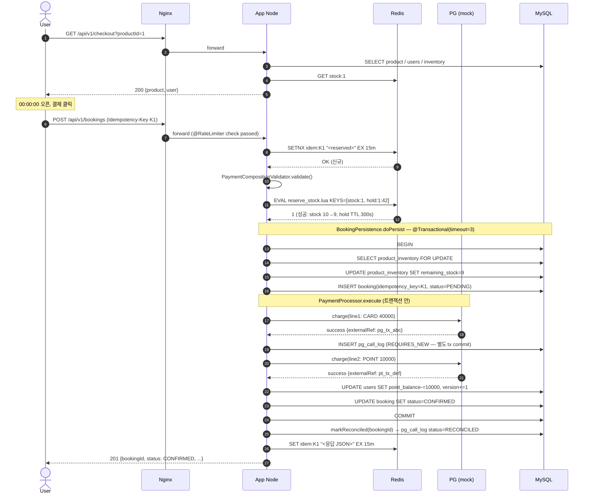
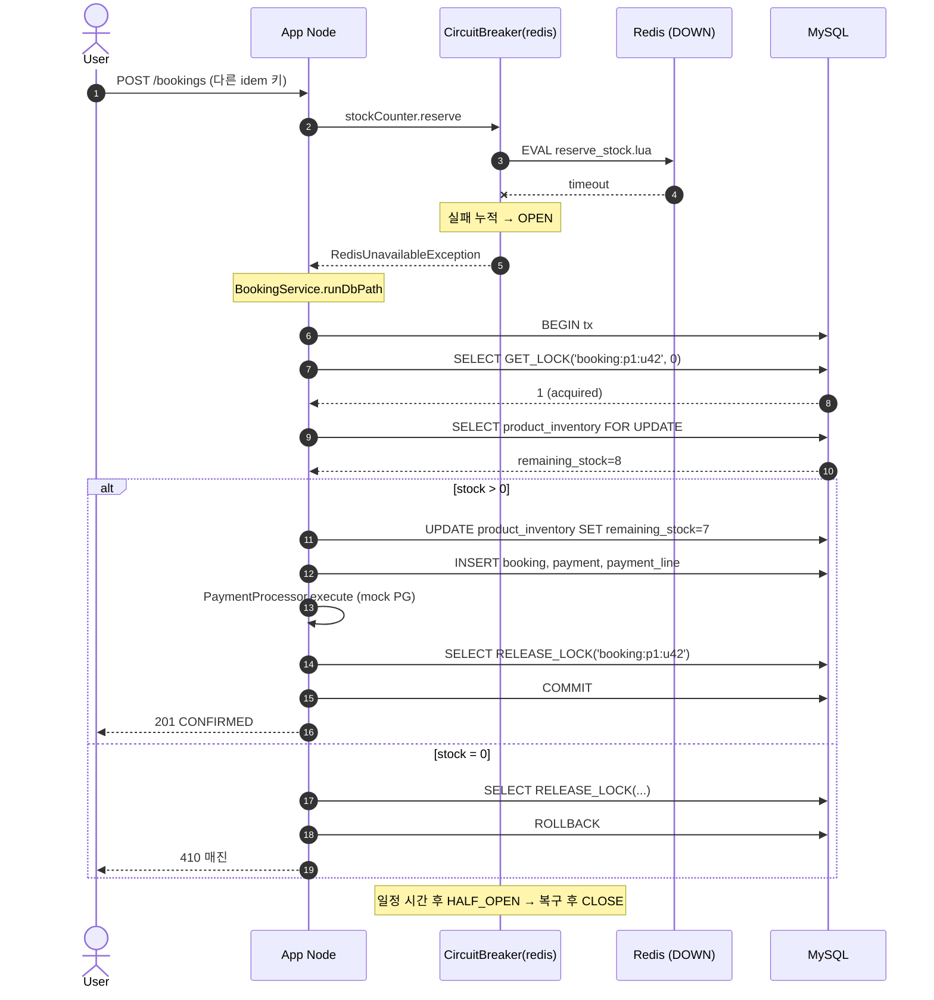
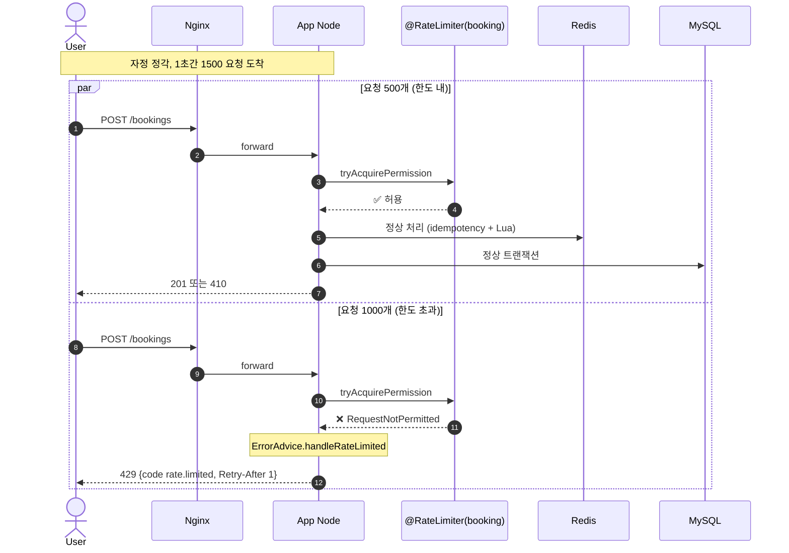
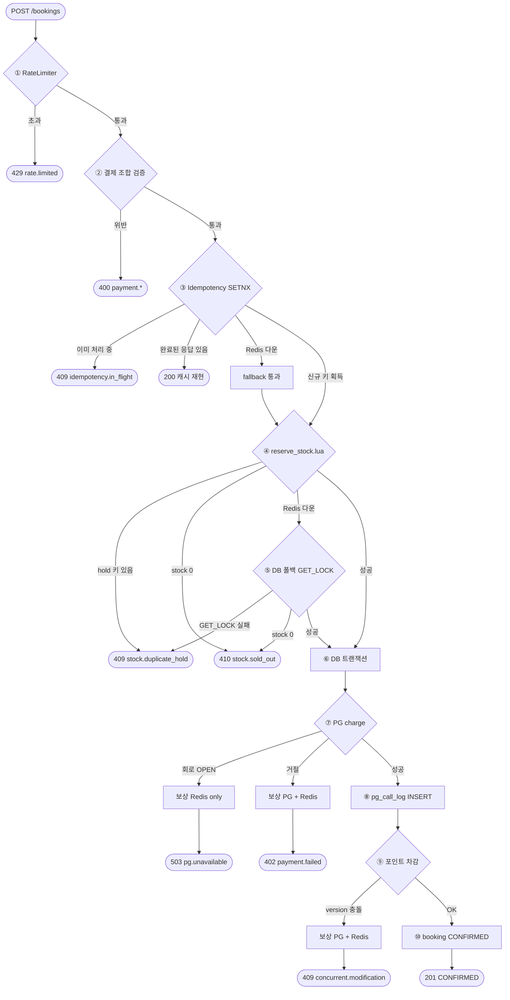

# Flash Booking Platform

선착순 한정 재고 (10건) 상품에 대한 분산 환경 (App 2노드) 예약/결제 시스템.

본 문서는 *무엇 / 어떻게* 가 중심이고, *왜* 의 판단 근거는 [DECISIONS.md](DECISIONS.md) 에 있다.

## 목차

| # | 섹션 | 내용 |
|---|---|---|
| 1 | [시스템 아키텍처](#1-시스템-아키텍처) | 토폴로지 + 기술 스택 선택 이유 |
| 2 | [API](#2-api) | `GET /checkout` / `POST /bookings` 명세 + 응답 코드 |
| 3 | [실행 방법](#3-실행-방법) | 부팅 / 자동화 테스트 / 부하 테스트 |
| 4 | [데이터 모델 (ERD)](#4-데이터-모델-erd) | 7개 테이블 ERD + 정합성 핵심 |
| 5 | [시퀀스 다이어그램](#5-시퀀스-다이어그램) | S1 정상 / S4 Redis 폴백 / S6 RateLimiter |
| 6 | [플로우 차트](#6-플로우-차트) | `POST /bookings` 모든 분기 ↔ 응답 코드 ↔ DECISIONS 매핑 |

---

## 1. 시스템 아키텍처

```
                    ┌─→ App #1 ─┐       ┌─→ Redis
Client ─→ Nginx ────┤           ├───────┼─→ MySQL
                    └─→ App #2 ─┘       └─→ PG (mock)
```

| 기술 | 용도 | 선택 이유 |
|---|---|---|
| Java 21 | 언어 | records + switch pattern matching 정식 지원으로 보일러플레이트 제거 |
| Spring Boot 3.2 | 프레임워크 | Java 21 호환 + Resilience4j 공식 통합으로 `@RateLimiter` / `@CircuitBreaker` 어노테이션 그대로 사용 |
| MySQL 8 | 영속 DB | 8.0.1+ `SKIP LOCKED` (멀티노드 sweeper 안전) + `GET_LOCK` (Redis 다운 폴백 시 락 대체) |
| Redis 7 | 재고 카운터 / 멱등 캐시 | Lua 스크립트로 `reserve` (재고 차감) / `release` (복구) / `reconcile` (정합성 동기화) 3종 원자 연산 — 핫패스 race 차단 |
| Nginx | 로드 밸런서 (2 노드) | App 2 노드에 `least_conn` (연결 수 적은 쪽 우선) 으로 부하 분산 |
| PG (mock) | 외부 결제 | Mock 구현 — 결제 라인 처리 로직 검증 목표 |

## 2. API

부팅 후 브라우저에서 Swagger UI 로 시도 가능 — `http://localhost/swagger-ui.html`

### `GET /api/v1/checkout` — 주문서 진입

상품 정보 + 잔여 재고 + 사용자 포인트 조회.

| 항목 | 위치 | 타입 | 비고 |
|---|---|---|---|
| `productId` | query | long | 양수 |
| `X-User-Id` | header | long | 양수 |

```json
// 200 OK
{
  "product": {
    "id": 1, "name": "시그니처 시티뷰 1박", "price": 50000,
    "checkInAt": "2026-06-10T15:00:00", "checkOutAt": "2026-06-11T11:00:00",
    "remainingStock": 10
  },
  "user": { "id": 42, "pointBalance": 10000 }
}
```

### `POST /api/v1/bookings` — 예약 / 결제 확정

결제 진행과 예약 확정을 *원자적으로* 수행. 멱등 키 필수.

| 항목 | 위치 | 타입 | 비고 |
|---|---|---|---|
| `X-User-Id` | header | long | 양수 |
| `Idempotency-Key` | header | string | UUID 권장. 1~64자 |
| body | body | JSON | 아래 참조 |

```json
// 요청
{
  "productId": 1,
  "payment": {
    "lines": [
      { "method": "CREDIT_CARD", "amount": 40000, "attributes": { "cardNo": "****" } },
      { "method": "Y_POINT",     "amount": 10000, "attributes": {} }
    ]
  }
}

// 201 Created
{
  "bookingId": 123,
  "status": "CONFIRMED",
  "confirmedAt": "2026-06-10T00:00:01.234",
  "payment": {
    "totalAmount": 50000,
    "lines": [
      { "method": "CREDIT_CARD", "amount": 40000, "externalRef": "pg_tx_abc" },
      { "method": "Y_POINT",     "amount": 10000, "externalRef": "pt_tx_def" }
    ]
  }
}
```

### 응답 코드

| HTTP | code | 발생 조건 |
|---|---|---|
| 201 | — | 정상 생성 |
| 200 | — | 동일 멱등 키 재요청 (캐시 응답 재현) |
| 400 | `payment.*` | 조합 / 금액 검증 위반 |
| 400 | `idempotency.key.invalid` | 멱등 키 형식 위반 |
| 402 | `payment.failed` | PG 거절 / 잔액 부족 — 보상 완료 후 응답 |
| 409 | `idempotency.in_flight` | 동일 키 동시 도착 |
| 409 | `stock.duplicate_hold` | 동일 사용자 진행 중 |
| 409 | `concurrent.modification` | 사용자 포인트 낙관 락 충돌 |
| 410 | `stock.sold_out` | 매진 |
| 429 | `rate.limited` | 노드당 500 req/sec 초과 — `Retry-After: 1` |
| 503 | `pg.unavailable` | PG 회로 차단기 OPEN |

전체 에러 카탈로그: [`ErrorCode.java`](src/main/java/com/example/booking/interfaces/common/ErrorCode.java)

## 3. 실행 방법

**전제**: Docker / Docker Compose. JDK·Gradle 로컬 설치 불필요 (Dockerfile 안에서 Gradle 빌드 → JRE 이미지에 jar 복사).

### 3-1. 부팅

```bash
# 1. 인프라 + App 2 노드 기동
docker compose up --build -d

# 2. 헬스체크 (앱 부팅 자동 재시도)
curl --retry 30 --retry-delay 2 --retry-connrefused -w "\n" http://localhost/actuator/health
# 기대: {"status":"UP",...}

# 3. Swagger UI 에서 API 시도 (브라우저)
# http://localhost/swagger-ui.html

# 4. 종료 + 데이터 초기화
docker compose down -v
```

시드: `product#1/2` (재고 10 / 10), `users#1/2/3` (포인트 10,000 / 50,000 / 0).

### 3-2. 자동화 테스트

```bash
./gradlew clean test
```

Testcontainers (MySQL 8 + Redis 7) 자동 기동. 첫 실행 시 이미지 다운로드 발생.

| 테스트 | 검증 내용 |
|---|---|
| `PaymentCompositionValidatorTest` | 결제 조합 규칙 (단위 11건) |
| `BookingIntegrationTest` | 정상 / 멱등 / 결제 실패 / 조합 위반 / 매진 |
| `ConcurrentModificationTest` | 낙관적 락 충돌 → 409 |
| `DbFallbackTest` | Redis 다운 → DB 폴백 경로 |
| `RateLimiterTest` | 한도 초과 → 429 + `Retry-After` |
| `ReconcileStockLuaTest` | Lua 원자성 5 분기 (활성 hold / 키 없음 / drift / over-credit / 일치) |
| `ResilienceTest` | PG 회로 차단기 OPEN → 503 |
| `SweeperTest` | Outbox orphan 환불 + 이벤트 기반 hold 즉시 해제 |

### 3-3. 부하 테스트

평시 50 TPS → 1000 TPS 급증 시나리오 + Redis 다운 카오스 시나리오 2 종.

절차 / 검증 포인트 / 실측 결과: [`docs/load-test.md`](docs/load-test.md)

## 4. 데이터 모델 (ERD) <sub>· 상세 [`docs/erd.md`](docs/erd.md)</sub>



| 테이블 | 역할 | 정합성 핵심 |
|---|---|---|
| `users` | 사용자 + 포인트 잔액 | `version` (낙관 락 — 동일 사용자 동시 결제 시 1건만 성공) |
| `product` / `product_inventory` | 상품 + 재고 분리 | 재고 행만 잠금 → 상품 조회 비차단. `version` 으로 폴백 경로 충돌 감지 |
| `booking` | 예약 마스터 | `UNIQUE(idempotency_key)` — Redis 누수 시 최후 멱등 방어선 |
| `payment` / `payment_line` | 결제 + 수단별 분할 | `UNIQUE(booking_id)` + line N행 (Strategy 데이터 표현) |
| `pg_call_log` | Outbox — PG 호출 흔적 | `REQUIRES_NEW` 별도 commit. 인덱스 `(status, created_at)` — sweeper 핫패스 |
| `point_transaction` | 포인트 원장 | 차감 / 적립 양방향. `(user_id)`, `(ref_id)` 인덱스 |


## 5. 시퀀스 다이어그램 <sub>· 6종 전체 [`docs/sequence.md`](docs/sequence.md)</sub>

본문엔 핵심 3종 (S1 정상 / S4 Redis 폴백 / S6 RateLimiter) 만 수록.

### S1. 정상 예약 플로우



- Redis Lua 가 *"stock 확인 + DECR + hold 등록"* 을 단일 원자 연산으로 처리 → race 원천 차단
- PG 호출은 *DB 트랜잭션 안* ([DECISIONS 8](DECISIONS.md)) — Lua 가 99% 차단해 DB 도달이 ~10건 / 피크
- `pg_call_log` 는 `REQUIRES_NEW` → 메인 tx 롤백돼도 흔적 살아남음 (Outbox)

### S4. Redis 장애 폴백



- 폴백 경계 2 곳:
  1. 멱등 체크 (`IdempotencyStore`) — fallback 으로 통과 (DB UNIQUE 제약이 최후 방어)
  2. 재고 reserve (`StockCounter`) — `GET_LOCK` + `FOR UPDATE` 로 폴백
- `GET_LOCK(..., 0)` — NOWAIT 으로 즉시 결과. `finally` 블록에서 `RELEASE_LOCK` 보장

### S6. RateLimiter 초과 차단



- 노드당 500 / sec → 2 노드 시스템 합계 *1000 / sec* (피크 수용 한도)
- `timeoutDuration: 0` → 초과 즉시 거절 = cascade 차단
- 정상 시 Lua 가 99% 차단 → RateLimiter 거의 발동 안 함. *비정상 (Redis 다운 + 폭주)* 시 DB 보호 핵심 안전망

## 6. 플로우 차트

`POST /api/v1/bookings` 1 건이 처리되는 *모든 분기와 응답 코드* 한 화면.

시퀀스 다이어그램이 *시간 축 (언제 무엇이 일어나나)* 을 보여준다면, 플로우 차트는 *결정 분기 (어느 조건에서 어느 응답이 나가나)* 를 보여준다.

### 처리 노드 (① ~ ⑩)

| ID | 단계 | 의미 |
|---|---|---|
| `RL` | ① | `@RateLimiter(booking)` — 노드당 500/s 입구 차단 |
| `VAL` | ② | `PaymentCompositionValidator` — 결제 라인 조합/금액 검증 |
| `IDEM` | ③ | `Idempotency-Key` Redis SETNX |
| `FALLBACK_IDEM` | ③` | Redis 다운 시 통과 — DB UNIQUE 제약이 최후 멱등 방어 |
| `LUA` | ④ | `reserve_stock.lua` — `EXISTS hold` + `DECR stock` 원자 차감 |
| `FALLBACK_STOCK` | ⑤ | DB 폴백 — `GET_LOCK(NOWAIT)` + `FOR UPDATE` |
| `TX` | ⑥ | DB 트랜잭션 시작 — `@Transactional(timeout=3)` |
| `PG` | ⑦ | `PaymentGateway.charge()` 외부 호출 (CircuitBreaker 적용) |
| `COMP_R` | — | 보상 (Redis only) — `stock INCR` + `hold DEL`. 회로 OPEN이라 PG 미호출 → cancel 불필요 |
| `COMP_F` | — | 보상 (PG + Redis) — `PG cancel` + `stock INCR` + `hold DEL`. PG charge 미발생 또는 거절 |
| `COMP_V` | — | 보상 (PG + Redis) — `PG cancel` + `stock INCR` + `hold DEL`. PG charge 성공 후 포인트 충돌 |
| `OUTBOX` | ⑧ | `pg_call_log` INSERT — `REQUIRES_NEW` 별도 commit (sweeper 추적용) |
| `POINT` | ⑨ | `users.point_balance` 차감 + `@Version` 낙관 락 체크 |
| `COMMIT` | ⑩ | `booking` 상태 `CONFIRMED` + 메인 트랜잭션 COMMIT + 멱등 캐시 저장. hold 키는 TTL 300초 자연 만료 (정상 결제 시 stock 복구 불가하므로 명시적 release 미호출) |

### 응답 노드 (`R*` 접두사)

| ID | HTTP | error code | 발생 단계 |
|---|---|---|---|
| `R201` | 201 | — | ⑩ COMMIT 성공 (정상 신규) |
| `R200` | 200 | — | ③ 동일 멱등 키 재요청 — 기존 응답 재현 |
| `R400` | 400 | `payment.*` | ② 결제 조합/금액 검증 위반 |
| `R402` | 402 | `payment.failed` | ⑦ PG 거절 / 잔액 부족 (보상 완료 후) |
| `R409I` | 409 | `idempotency.in_flight` | ③ 동일 키 동시 도착 |
| `R409H` | 409 | `stock.duplicate_hold` | ④/⑤ 동일 사용자 진행 중 |
| `R409V` | 409 | `concurrent.modification` | ⑨ 포인트 낙관 락 충돌 |
| `R410` | 410 | `stock.sold_out` | ④/⑤ 매진 |
| `R429` | 429 | `rate.limited` | ① RateLimiter 초과 (`Retry-After: 1`) |
| `R503P` | 503 | `pg.unavailable` | ⑦ PG CircuitBreaker OPEN |

### 다이어그램


