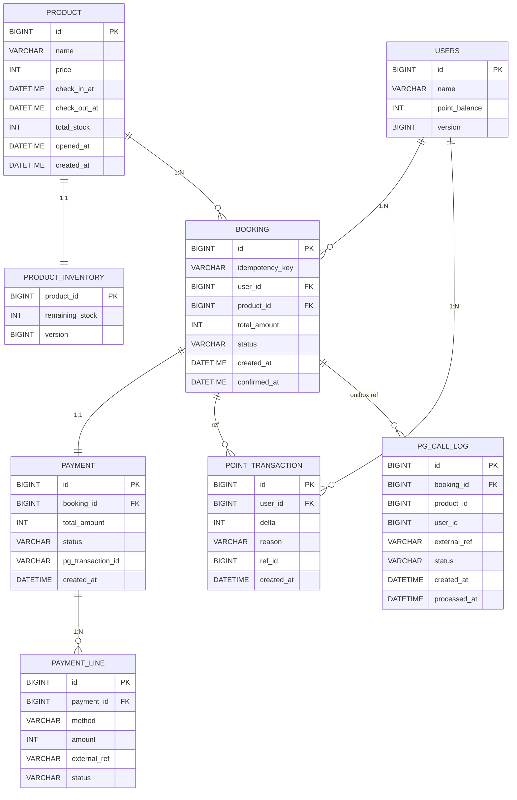

# ERD

주문/결제 도메인 중심 데이터 모델. MySQL 8.0 InnoDB 가정.

## 다이어그램



---

## 테이블별 컬럼 의미

### `product`
상품 마스터.

| 컬럼 | 타입 | 의미 |
|---|---|---|
| `id` | BIGINT PK | 상품 식별자 |
| `name` | VARCHAR(200) | 상품명 |
| `price` | INT | 원 단위 가격(소수점 없음) |
| `check_in_at` / `check_out_at` | DATETIME | 입/퇴실 시각 |
| `total_stock` | INT | 초기 한정 수량(10) |
| `opened_at` | DATETIME | 판매 오픈 시각(00시) |
| `created_at` | DATETIME | 행 생성 시각 (DEFAULT CURRENT_TIMESTAMP) |

> **인덱스**: PK만. 단일 핫상품 중심 시나리오라 별도 인덱스 불요.

### `product_inventory`
재고 카운터의 DB 측 진실원천. 평시는 Redis 카운터가 핫패스를 처리하고, 폴백/정산 시 이 테이블이 기준이 된다.

| 컬럼 | 타입 | 의미 |
|---|---|---|
| `product_id` | BIGINT PK/FK | `product.id` 1:1 |
| `remaining_stock` | INT | 잔여 수량 |
| `version` | BIGINT | Optimistic Lock 용 |

> **분리 이유**: `product` 행을 자주 UPDATE하면 캐시 무효화가 잦아진다. 재고만 별도 테이블로 분리.

### `users`
사용자 정보. 인증/보안은 평가 범위 외이므로 최소 컬럼만.

| 컬럼 | 타입 | 의미 |
|---|---|---|
| `id` | BIGINT PK | 사용자 식별자 |
| `name` | VARCHAR(100) | 표시명 |
| `point_balance` | INT | 보유 포인트 (캐시된 값) |
| `version` | BIGINT | Optimistic Lock |

> **point_balance의 정합성**: 진실원천은 `point_transaction`의 합계. `point_balance`는 빠른 조회를 위한 비정규화 캐시. 결제 트랜잭션 안에서 함께 갱신.

### `booking`
예약(주문서) 엔티티.

| 컬럼 | 타입 | 의미 |
|---|---|---|
| `id` | BIGINT PK | |
| `idempotency_key` | VARCHAR(64) UNIQUE | 클라이언트 제공 UUID. **DB 레벨 최후 멱등 방어선** |
| `user_id` / `product_id` | BIGINT NOT NULL | |
| `total_amount` | INT NOT NULL | 결제 총액 (라인 합계와 동일) |
| `status` | VARCHAR(20) NOT NULL | `PENDING` → `CONFIRMED` |
| `created_at` | DATETIME | 행 생성 시각 (DEFAULT CURRENT_TIMESTAMP) |
| `confirmed_at` | DATETIME NULL | CONFIRMED 시각 |

> **인덱스**: `uk_booking_idem(idempotency_key)`, `idx_booking_user`, `idx_booking_product`. UNIQUE 제약이 동시 INSERT 충돌을 차단한다.

### `payment`
결제 헤더. booking 1:1.

| 컬럼 | 타입 | 의미 |
|---|---|---|
| `id` | BIGINT PK | |
| `booking_id` | BIGINT NOT NULL, UNIQUE | 1:1 보장 (`uk_payment_booking`) |
| `total_amount` | INT NOT NULL | |
| `status` | VARCHAR(20) NOT NULL | `PENDING` → `SUCCESS` / `FAILED` |
| `pg_transaction_id` | VARCHAR(100) NULL | PG 측 거래 ID (대표 라인 또는 그룹) |
| `created_at` | DATETIME | |

### `payment_line`
결제 수단별 라인. 복합 결제는 라인이 2개.

| 컬럼 | 타입 | 의미 |
|---|---|---|
| `id` | BIGINT PK | |
| `payment_id` | BIGINT FK | |
| `method` | VARCHAR(20) | `CREDIT_CARD` / `Y_PAY` / `Y_POINT` |
| `amount` | INT | 라인 금액 |
| `external_ref` | VARCHAR(100) NULL | PG/포인트 시스템의 거래 참조 (cancel 시 사용) |
| `status` | VARCHAR(20) | `PENDING` / `SUCCESS` / `FAILED` |

> **확장성**: 새 결제수단이 추가돼도 `method` 값만 늘어나면 됨. 스키마 변경 없음.

### `point_transaction`
포인트 이력. 진실원천(append-only 원장).

| 컬럼 | 타입 | 의미 |
|---|---|---|
| `id` | BIGINT PK | |
| `user_id` | BIGINT FK | |
| `delta` | INT | 음수=차감, 양수=적립/환불 |
| `reason` | VARCHAR(40) | `BOOKING_USE` 등 |
| `ref_id` | BIGINT NULL | 관련 `booking.id` 등 |
| `created_at` | DATETIME | |

> **append-only**: UPDATE/DELETE 없음. 잔액 검증은 `SUM(delta)` 또는 `users.point_balance`(캐시) 사용.

### `pg_call_log`
외부 PG 호출 outbox. booking 트랜잭션과 독립적으로 commit 되어, 트랜잭션 롤백으로 인한 orphaned PG charge 를 sweeper 가 추적할 수 있게 한다.

| 컬럼 | 타입 | 의미 |
|---|---|---|
| `id` | BIGINT PK | |
| `booking_id` | BIGINT NOT NULL | 연관 booking. 트랜잭션 롤백 시 booking 행이 없을 수 있음 (orphan) |
| `product_id` | BIGINT NULL | V4 추가. sweeper 가 환불 직후 *해당 사용자의 hold 키 즉시 해제* (event-driven release) 에 사용. V4 이전 행은 NULL — 그 경우 `reconcileStock` polling 이 backstop |
| `user_id` | BIGINT NULL | V4 추가. 위와 동일 용도 (`stockCounter.release(productId, userId)` 인자) |
| `external_ref` | VARCHAR(100) NOT NULL | PG 측 거래 ID — `PaymentGateway.cancel(externalRef)` 에 사용 |
| `status` | VARCHAR(20) NOT NULL | `PG_CHARGED` → `RECONCILED` (성공) 또는 `REFUNDED` (sweeper 처리) 또는 `REFUND_FAILED` |
| `created_at` | DATETIME | PG 호출 시각 |
| `processed_at` | DATETIME NULL | reconcile/refund 시각 |

> **인덱스**: `idx_pgcl_status_created(status, created_at)` — sweeper `findExpiredForRefund` 핫패스 + `idx_pgcl_booking(booking_id)` — booking 역참조.
> **저장 정책**: 외부 PG (`kind=MAIN`) 만 기록. 포인트(`kind=SUB`) 는 내부 DB 트랜잭션으로 자동 보상되므로 outbox 불요.

---

## 트랜잭션 범위

`POST /api/v1/bookings` 의 단일 DB 트랜잭션 (`BookingPersistence.doPersist`, `@Transactional(timeout = 3)`):

```sql
BEGIN;
  SELECT * FROM product_inventory WHERE product_id=? FOR UPDATE;
  UPDATE product_inventory SET remaining_stock = remaining_stock - 1, version = version + 1
    WHERE product_id = ? AND version = ?;
  INSERT INTO booking (idempotency_key, ..., status='PENDING');

  -- ↓ PaymentProcessor.execute (트랜잭션 안에서 PG 호출)
  -- ↓ PG.charge() 직후 별도 트랜잭션(REQUIRES_NEW)으로 outbox 기록:
  --     BEGIN; INSERT INTO pg_call_log(status='PG_CHARGED'); COMMIT;
  -- ↓ (위 outbox는 메인 트랜잭션 롤백돼도 살아남음)

  INSERT INTO payment (...);
  INSERT INTO payment_line (...);   -- N건
  INSERT INTO point_transaction (...);  -- 포인트 사용 시
  UPDATE users SET point_balance = point_balance - ?, version = version + 1
    WHERE id = ? AND version = ?;
  UPDATE booking SET status='CONFIRMED', confirmed_at=NOW();
COMMIT;
-- ↓ commit 후 pg_call_log 상태를 RECONCILED 로 마킹
```

- **PG 호출은 트랜잭션 *안*에서 진행** (DECISIONS 8번 참고). 정상 흐름에선 Redis Lua 가 99% 차단해 DB 도달 ~10건/피크 → 락 보유 200ms 영향 미미.
- `pg_call_log` 는 `REQUIRES_NEW` 로 *메인 트랜잭션과 독립* commit → 어떤 실패에도 PG 흔적 보존 → sweeper 가 환불 (Outbox 패턴, DECISIONS 5번 참고).
- `version` 체크 실패 (낙관적 락 충돌, 같은 사용자가 동시에 다른 booking 진행 시) → `OptimisticLockingFailureException` → 메인 트랜잭션 롤백 + sweeper 환불 + **HTTP 409 `concurrent.modification`** (DECISIONS 6번 참고).
- 트랜잭션 격리 수준: MySQL 기본 `REPEATABLE_READ` 유지. 본 워크로드 (한정 상품) 에서 락 비용 차이 미미.
- `@Transactional(timeout = 3)`: 3초 초과 시 자동 롤백 + 락 해제 → cascade 차단 (DECISIONS 2번 참고).

---

## 데이터 정합성 보장 매트릭스

| 정합성 항목 | 보장 메커니즘 |
|---|---|
| 재고 초과판매 | Redis Lua 원자 차감 + DB Optimistic Lock + 폴백 시 `SELECT FOR UPDATE` |
| 멱등 (중복 예약) | Redis SETNX + `booking.idempotency_key` UNIQUE 제약 |
| 결제 ↔ 예약 1:1 | `payment.booking_id` UNIQUE 제약 + 단일 트랜잭션 |
| 포인트 잔액 ↔ 이력 | `point_transaction` append-only + `users.point_balance` 동일 트랜잭션 갱신 |
| 결제 라인 합계 = 주문 금액 | 애플리케이션 검증(`PaymentCompositionValidator`) + DB CHECK 제약 추가 가능 |

---
