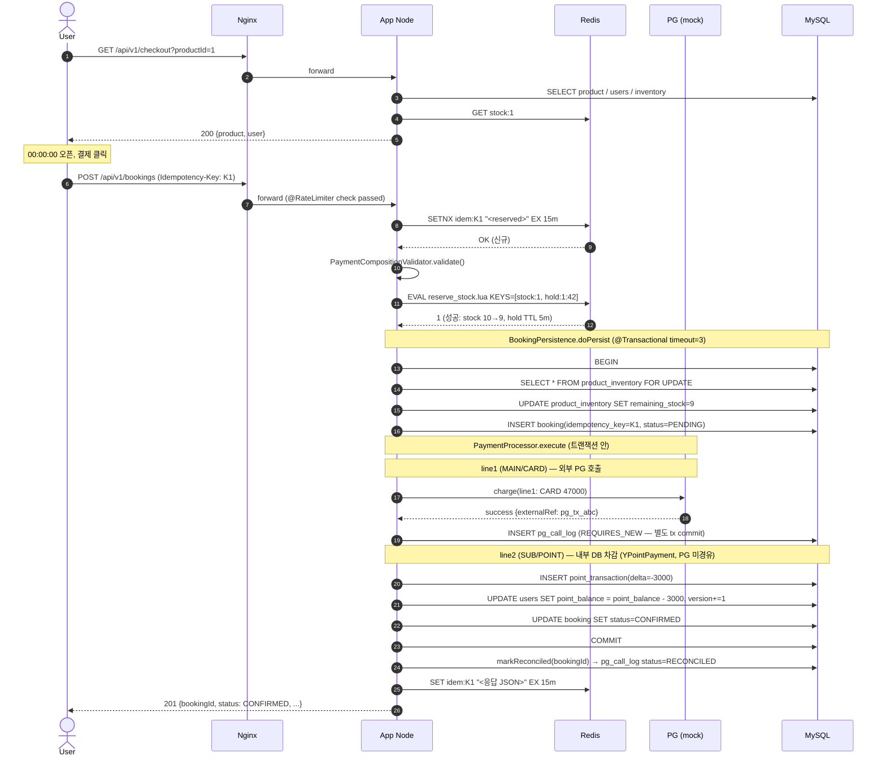
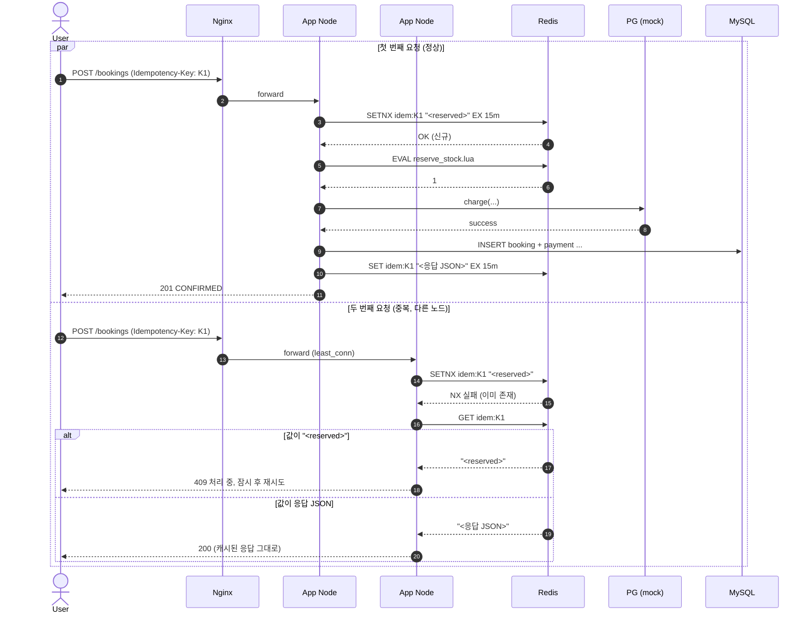
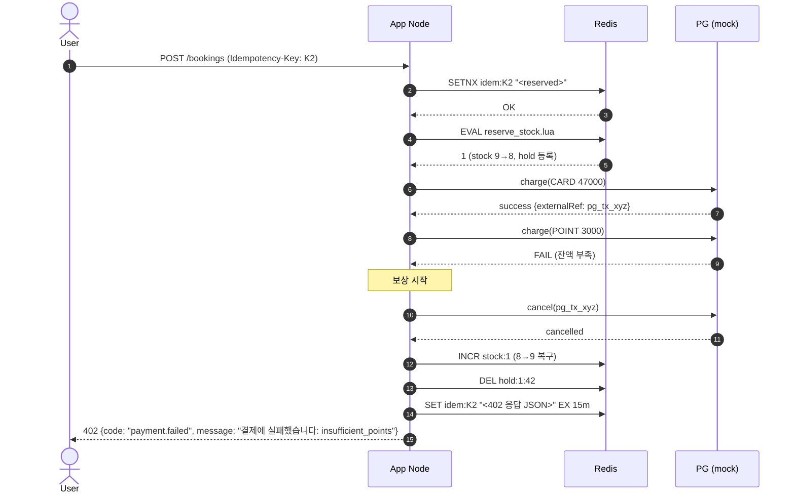
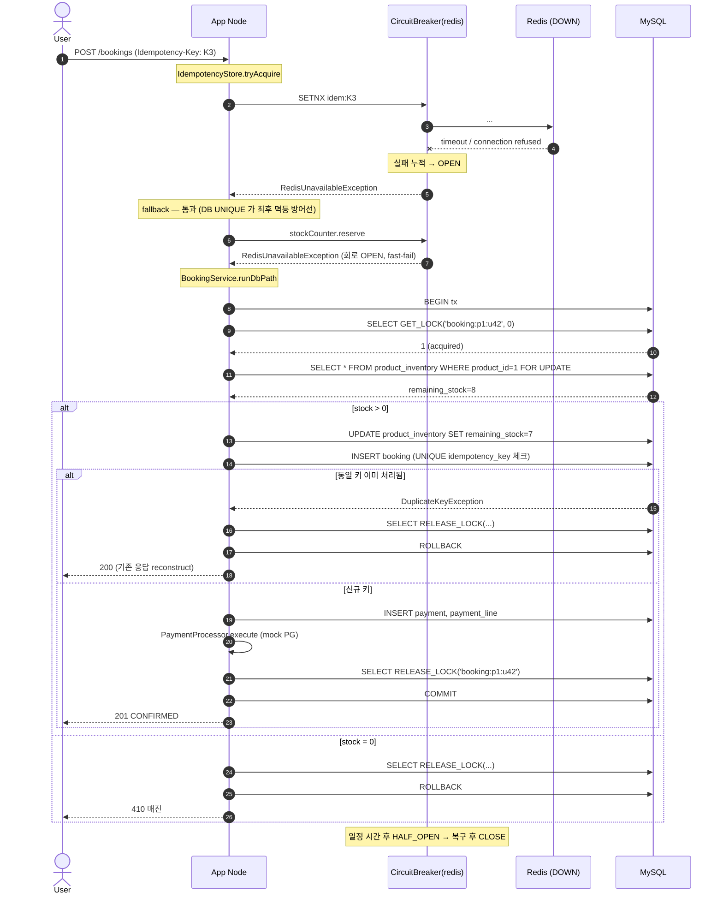
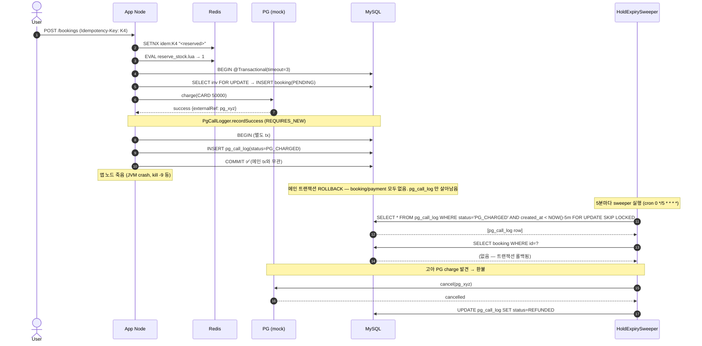
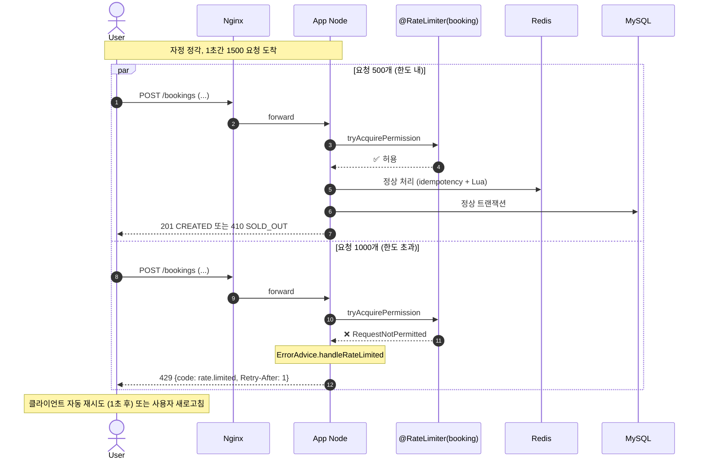

# Sequence Diagrams

주요 시나리오의 시퀀스 다이어그램. 모든 다이어그램은 Mermaid 문법으로 작성되어 GitHub에서 그대로 렌더링된다.

- [S1. 정상 예약 플로우](#s1-정상-예약-플로우)
- [S2. 멱등 키 중복 요청](#s2-멱등-키-중복-요청)
- [S3. 결제 실패 보상](#s3-결제-실패-보상)
- [S4. Redis 장애 폴백](#s4-redis-장애-폴백)
- [S5. PG 호출 후 앱 죽음 + Outbox 환불](#s5-pg-호출-후-앱-죽음--outbox-환불)
- [S6. RateLimiter 초과 차단](#s6-ratelimiter-초과-차단)

---

## S1. 정상 예약 플로우

사용자가 주문서 진입 → 결제 버튼 → 예약 확정까지의 정상 흐름.

**핵심 포인트**
- Redis Lua는 "stock 확인 + DECR + hold 등록"을 단일 원자 연산으로 수행 → race condition 원천 차단.
- **PG 호출은 DB 트랜잭션 *안*에서 진행** (DECISIONS 8번 참고). Redis Lua가 99% 차단해 DB 도달 ~10건/피크 → 락 보유 200ms 영향 미미.
- `pg_call_log`는 `REQUIRES_NEW`로 PG charge 직후 *별도 트랜잭션 commit* → 메인 트랜잭션 롤백돼도 흔적 살아남음.
- `hold` 키는 commit 직후 `release_stock.lua` 로 즉시 DEL (event-driven primary). 비정상 종료 대비 TTL 300초 backstop (DECISIONS 7번 참고).

---

## S2. 멱등 키 중복 요청

사용자 더블 클릭 또는 네트워크 재시도로 동일 `Idempotency-Key`가 두 번 도착.

**핵심 포인트**
- 두 요청이 서로 다른 앱 노드로 라우팅되어도 Redis가 단일 진실 원천이므로 안전.
- 비즈니스 처리가 끝나기 전 동시 중복이면 409로 빠른 거절, 끝난 후면 200으로 응답 재현.
- 최후 방어선: `booking.idempotency_key` UNIQUE 제약 (Redis 누수 시).

---

## S3. 결제 실패 보상

신용카드 결제는 성공했으나 포인트 차감이 실패한 케이스. 결제 라인 보상 + 재고 복구.

**핵심 포인트**
- **순서가 중요**: 외부 시스템 보상(PG cancel) → 내부 상태 복구(stock INCR + hold DEL) → 응답.
- 보상(PG cancel) 자체가 실패하면 어떻게? → `PaymentProcessor.compensate` 가 `log.error` 만 남기고 예외는 삼킨다. PG 흔적은 `pg_call_log` (REQUIRES_NEW) 에 살아있으므로 `HoldExpirySweeper.refundOrphanedPgCharges` 가 5분마다 backstop 으로 재환불 시도.
- 멱등키에 결제 실패 응답을 캐시하는 이유 (`BookingController.shouldCacheError` 가 402/410/400 만 캐시): 동일 키로 재시도해도 같은 결과를 받게 해 *PG 중복 charge* 방지.

---

## S4. Redis 장애 폴백

Redis 가 다운된 상황에서 회로 차단기가 OPEN 되고 **MySQL `GET_LOCK` 기반 advisory lock + `product_inventory FOR UPDATE`** 경로로 폴백.

**핵심 포인트**
- 폴백은 두 경계에서 발생:
  1. **멱등 키 체크 단계** (`IdempotencyStore`) — Redis 다운 시 fallback 으로 *통과* → `booking.idempotency_key` UNIQUE 제약이 최후 방어선 (동일 키 중복 INSERT 거부 + `reconstruct` 로 같은 응답 재구성).
  2. **재고 reserve 단계** (`StockCounter.reserve`) — DB advisory lock + `FOR UPDATE` 로 폴백.
- `MySQL GET_LOCK('booking:p{}:u{}', 0)` — timeout=0 (NOWAIT) 으로 즉시 결과 반환. 다른 사용자끼리는 락 충돌 없음.
- `product_inventory FOR UPDATE` 가 모든 동시 요청을 직렬화하여 매진 정합성 보장.
- `finally { RELEASE_LOCK(...) }` 로 connection 풀 반환 시 lock 잔존 방지.
- 처리량은 ~50 TPS 수준으로 떨어지지만, 매진 임박 시점이라 사용자 영향 제한 (DECISIONS 4번 참고).

---

## S5. PG 호출 후 앱 죽음 + Outbox 환불

PG charge 직후 메인 트랜잭션 commit 전에 앱이 죽는 경우. **돈 손실 없음** 을 보장하는 Outbox 패턴.

**핵심 포인트**
- `pg_call_log` 의 `REQUIRES_NEW` 가 핵심 — 메인 트랜잭션과 *독립 commit* → 어떤 실패에도 흔적 남음.
- `SELECT ... FOR UPDATE SKIP LOCKED` (MySQL 8.0+) 가 멀티 노드 sweeper 중복 처리 차단.
- Redis hold 키는 TTL (5분) 으로 자동 만료 → 다른 사용자가 그 자리 잡을 수 있음.
- 사용자: 응답 못 받음 → 멱등키로 재시도하면 신규 처리 (기존 흔적 환불됨).
- **PG charge 후 `pg_call_log` INSERT 사이 (~0.1ms 윈도우)** 만 *유일한 잔여 위험* — 매우 좁음.

---

## S6. RateLimiter 초과 차단

자정 폭주 시 시스템 1000 TPS 한도 초과 → 입구에서 차단.

**핵심 포인트**
- `@RateLimiter(name="booking")` 는 **노드당** 500/sec → 2 노드 시스템 합계 **1000/sec** (피크 수용 한도).
- 큐 대기 0초 (`timeoutDuration: 0`) → 초과 즉시 거절 = cascade 차단.
- *정상 시나리오* (Redis Lua 가 99% 차단) 엔 RateLimiter 거의 발동 안 함.
- *비정상 시나리오* (Redis 다운 + 1000 TPS) 에 *DB 보호 핵심 안전망* (DECISIONS 1번 참고).

---
